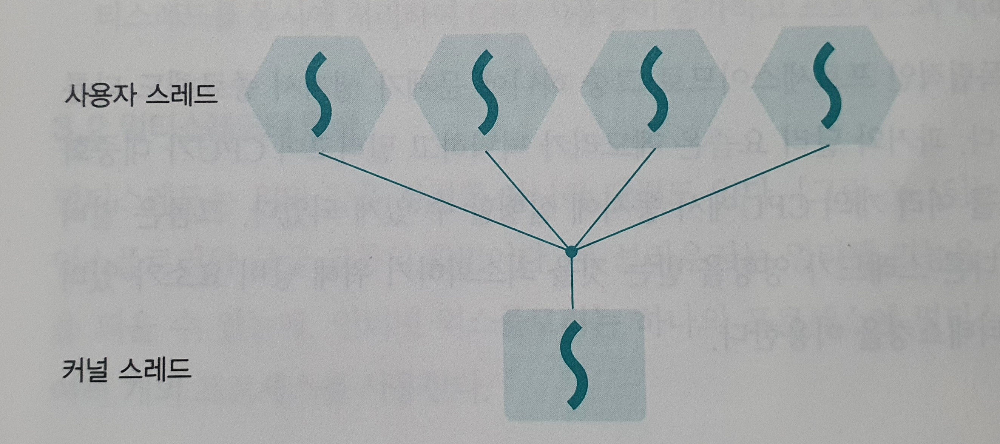
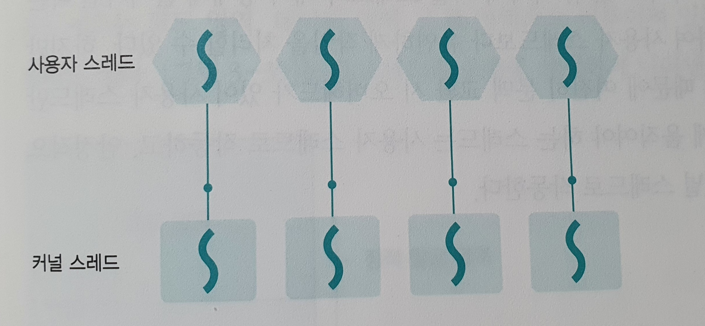
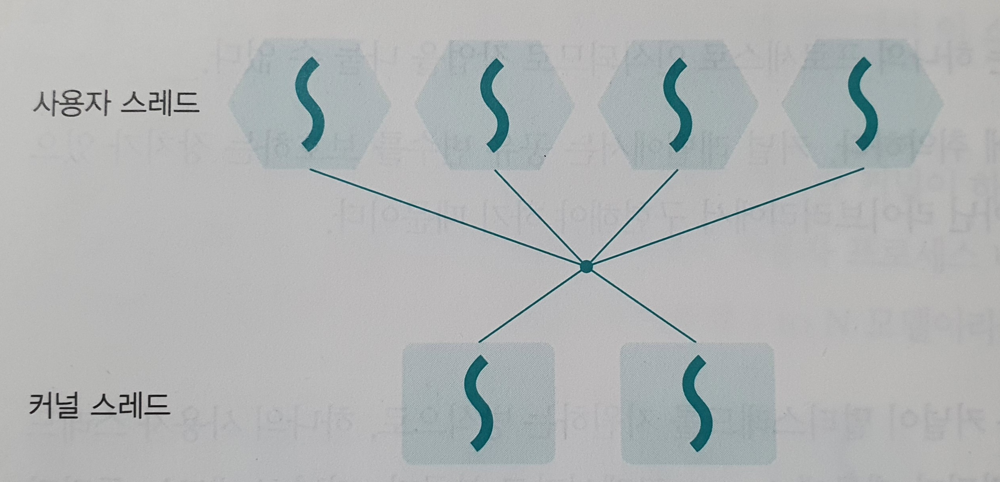

# 스레드

## 스레드의 개념

### 스레드의 정의

스레드는 프로세스 코드에 정의된 절차에 따라 CPU에 작업 요청을 하는 실행 단위이다.

 

#### :pencil2: 작업의 크기

작업을 상대적 크기 순으로 나열하면 job > task > operation이고, 이를 프로세스와 스레드의 관계에 대입하면 처리(job) > 프로세스(task) > 스레드(operation)가 된다. 

 

### 프로세스와 스레드의 차이

프로세스끼리는 약하게 연결되어 있는 반면 스레드끼리는 강하게 연결되어 있다.

프로세스는 서로 독립적이며 데이터를 주고받을 때 데이터 간 통신을 이용한다. 스레드는 서로 변수나 파일 등을 공유하고 전역변수나 함수 호출 등의 방법으로 스레드 간 통신을 한다.

 

### 스레드 관련 용어

- 멀티스레드 : 프로세스 내 작업을 여러 개의 스레드로 분할함으로써 작업의 부담을 죽이는 프로세스 운영 기법

- 멀티태스킹 : 운영체제가 CPU에게 작업을 줄 때 시간을 잘게 나누어 배분하는 기법으로 여러 스레드에 시간을 잘게 나누어 주는 시스템을 시분할 시스템이라고 함

  시분할 시스템에서 운영체제가 CPU에게 전달하는 작업은 프로세스가 아니라 스레드임

- 멀티프로세싱 : CPU를 여러 개 사용하여 여러 개의 스레드를 동시에 처리하는 작업 환경

- CPU 멀티스레드 : 한 번에 하나씩 처리해야 하는 스레드를 파이프라인 기법을 이용하여 동시에 여러 스레드를 처리하도록 만든 병렬 기법

  멀티스레드는 운영체제가 소프트웨어적으로 프로세스를 작은 단위인 스레드로 분할하여 운영하는 기법이지만, CPU 멀티스레드는 하드웨어적 방법으로 하나의 CPU에서 여러 스레드를 동시에 처리하는 병렬 처리 기법

 

## 멀티스레드의 구조와 예

### 멀티스레드의 구조

비슷한 일을 하는 2개의 프로세스를 만드는 경우 코드 영역과 데이터 영역의 일부가 메모리에 중복되어 존재하기 때문에 메모리의 낭비가 발생한다. 스레드는 이러한 멀티태스킹의 낭비 요소를 제거하기 위해 사용한다. 따라서 스레드는 코드, 데이터 등을 공유하며 여러 개의 일을 하나의 프로세스 내에서 한다.

메모리의 낭비를 방지하는 멀티 스레드는 가벼운 프로세스(Light Weight Process, LWP)라고 부르며, 스레드가 1개인 일반 프로세스는 무거운 프로세스(Heavy Weight Process, HWP)라고 부른다.

 

## 멀티스레드의 장단점

### 멀티스레드의 장점

- 응답성 향상 : 한 스레드가 입출력으로 인해 작업이 진행되지 않더라도 다른 스레드가 작업을 계속하여 사용자의 작업 요구에 빨리 응답할 수 있다.
- 자원 공유 : 자원의 중복을 피함으로써 낭비를 막을 수 있다.
- 효율성 향상 : 서로 독립적으로 작동하기 때문에 작업의 효율을 높일 수 있다.
- 다중 CPU 지원 : 2개 이상의 CPU를 가진 컴퓨터에서 멀티스레드를 사용하면 다중 CPU가 멀티스레드를 동시에 처리하여 프로세스의 처리 시간이 단축된다.

 

### 멀티스레드의 단점

- 한 스레드에 문제가 생기면 전체 프로세스에 영향을 미친다.

 

## 멀티스레드 모델

### 사용자 스레드

운영체제가 멀티스레드를 지원하지 않을 때 사용하는 방법으로 초기의 시스템에서 이용되었다. 사용자 레벨에서 스레드를 구현하기 때문에 라이브러리를 사용하여 구현하며, 라이브러리는 커널이 지원하는 스케줄링이나 동기화 같은 기능을 대신 구현해준다. 따라서 커널 입장에서 해당 스레드는 하나의 프로세스처럼 보인다.

사용자 프로세스 내에 여러 개의 스레드가 존재하지만 커널의 스레드 하나와 연결되기 때문에 1 to N 모델이라고 부른다. 

라이브러리가 직접 스케줄링을 하고 작업에 필요한 정보를 처리하기 때문에 문맥 교환이 필요없다. 따라서 속도가 빠르다.

 

사용자 스레드의 단점

- 여러 개의 스레드가 하나의 커널 스레드와 연결되기 때문에 커널 스레드가 대기 상태에 들어가면 모든 사용자 스레드가 같이 대기하게 됨
- 한 프로세스의 타임 슬라이드를 여러 스레드가 공유하기 때문에 여러 개의 CPU를 동시에 사용 불가능
- 공유 변수를 보호하는 장치가 없어 보안에 취약함

 

### 커널 스레드

커널이 멀티스레드를 지원하는 방식으로 하나의 사용자 스레드가 하나의 커널 스레드와 연결되기 때문에 1 to 1 모델이라고 부른다. 독립적으로 스케줄링되므로 특정 스레드가 대기 상태에 들어가도 다른 스레드는 작업을 계속할 수 있다. 또한 커널이 제공하는 보호 기능과 같은 모든 기능을 사용할 수 있다.

 

커널 스레드의 장점

- 커널에서 모든 작업을 지원하기 때문에 멀티 CPU 사용 가능
- 하나의 스레드가 대기 상태에 있어도 다른 스레드는 작업 가능
- 보안에 강하고 안정적

 

커널 스레드의 단점

- 문맥 교환을 할 때 오버헤드 때문에 느리게 작동함

 

### 멀티레벨 스레드

하이브리드 스레드라고도 하며 사용자 스레드와 커널 스레드를 혼합한 방식이다. M to N 모델이라고 부른다. 커널 스레드의 개수가 사용자 스레드보다 같거나 적다.

사용자 스레드와 커널 스레드의 장단점을 모두 가진다. 하나의 커널 스레드가 대기 상태에 들어가면 다른 커널 스레드가 대신 작업하여 유연한 작업을 할 수 있으나, 문맥 교환 시 오버헤드가 존재한다. 따라서 빠르게 움직여야 하는 스레드는 사용자 스레드로 작동하고, 안정적으로 움직여야 하는 스레드는 커널 스레드로 작동한다.
