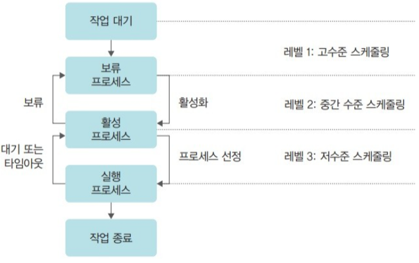

# 스케줄링의 개요

## 스케줄링의 단계

 

### 고수준 스케줄링

가장 큰 틀에서 이루어지는 CPU 스케줄링을 고수준 스케줄링, 장기 스케줄링, 작업 스케줄링이라고 한다. 

고수준 스케줄링은 시스템 내의 전체 작업 수를 조절하는 것을 말한다. 여기에서 작업은 운영체제에서 다루는 일의 가장 큰 단위로 1개 또는 여러 개의 프로세스로 이루어진다. 

작업 요청이 오면 스케줄러가 시스템의 상황을 고려해 작업을 승인할지 거부할지 결정하므로 승인 스케줄링이라고도 한다. 작업 요청을 결정하여 시스템의 전체 프로세스 수를 결정하는 것을 멀티 프로그래밍 정도라고 한다.

메인 프레임과 같은 큰 시스템에서 규모가 큰 일괄 작업을 처리할 때 사용한다.

 

### 저수준 스케줄링

가장 작은 단위의 스케줄링을 저수준 스케줄링이라고 한다. 어떤 프로세스에 CPU를 할당할지, 어떤 프로세스를 대기 상태로 보낼지 등을 결정하는 것이다. 

저수준 스케줄링은 아주 짧은 시간에 일어나기 때문에 단기 스케줄링이라고도 부른다.

 

### 중간 수준 스케줄링

고수준 스케줄링과 저수준 스케줄링 사이에 일어나는 스케줄링이다. 중지와 활성화를 통해 전체 시스템의 활성화된 프로세스 수를 조절하여 과부하를 막는다. 이는 프로세스 상태 중 보류 상태에 해당하며 저수준 스케줄링이 원만하게 이루어지도록 완충하는 역할을 한다.

 

## 스케줄링의 목적

- 공평성 : 모든 프로세스가 자원을 공평하게 배정받아야 하며, 자원 배정 과정에서 특정 프로세스가 배제되어서는 안 된다.
- 효율성 : 시스템 자원이 유휴 시간 없이 사용되도록 스케줄링을 하고, 유휴 자원을 사용하려는 프로세스에 우선권을 주어야 한다.
- 안정성 : 우선순위를 사용하여 중요 프로세스가 먼저 작동하도록 배정함으로써 시스템 자원을 점유하거나 파괴하려는 프로세스로부터 자원을 보호해야 한다.
- 확장성 : 프로세스 가 증가해도 시스템이 안정적으로 작동하도록 조치해야 한다. 또한 시스템 자원이 늘어나는 경우 이 혜택이 시스템에 반영되게 해야 한다.
- 반응 시간 보장 : 응답이 없는 경우 사용자는 시스템이 멈춘 것으로 가정하기 때문에 시스템은 적절한 시간 안에 프로세스의 요구에 반응해야 한다.
- 무한 연기 방지 : 특정 프로세스의 작업이 무한히 연기되엇

