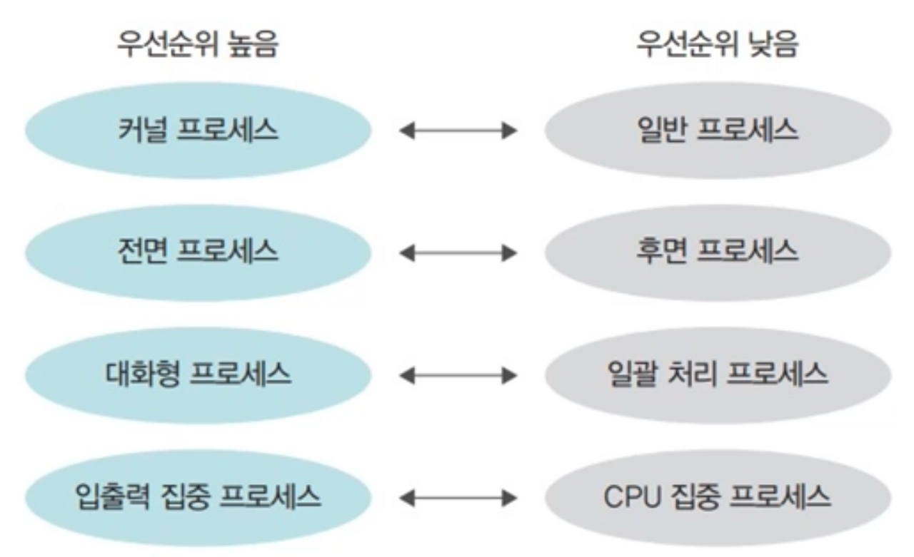

# 스케줄링 시 고려 사항

## 선점형 스케줄링과 비선점형 스케줄링

- 선점형 스케줄링 : 어떤 프로세스가 CPU를 할당받아 실행 중이더라도 운영체제가 CPU를 강제로 빼앗을 수 있는 스케줄링 방식이다. 대표적인 예로 인터럽트 처리가 있다. 문맥 교환 같은 부가적 작업으로 인해 낭비가 생기는 것이 단점이지만, 하나의 프로세스가 CPU를 독점할 수 없기 때문에 대화형 시스템이나 시분할 시스템에 적합하다. 
- 비선점형 스케줄링 : 어떤 프로세스가 CPU를 점유하면 다른 프로세스가 이를 빼앗을 수 없는 스케줄링 방식이다. 선점형 스케줄링보다 스케줄러의 작업량이 적고 문맥 교환에 의한 낭비도 적다. 그러나 전체 시스템의 처리율이 떨어진다. 과거 일괄 작업 시스템에서 사용하던 방식이다.

선점형 스케줄링 방식의 스케줄러에도 비선점형 프로세스가 있을 수 있다. 비선점형과 선점형 프로세스가 혼재하는 경우 비선점형 프로세스의 중요도를 매우 낮게 설정하여 선점형 프로세스에 영향을 덜 미치도록 한다.

 

| 구분      | 선점형                                                       | 비선점형                                                     |
| --------- | ------------------------------------------------------------ | ------------------------------------------------------------ |
| 작업 방식 | 실행 상태에 있는 작업을 중단시키고 새로운 작업을 실행할 수 있다. | 실행 상태에 있는 작업이 완료될 때까지 다른 작업이 불가능하다. |
| 장점      | 프로세스가 CPU를 독점할 수 없어 대화형이나 시분할 시스템에 적합하다. | CPU 스케줄러의 작업량이 적고 문맥 교환의 오버헤드가 적다.    |
| 단점      | 문맥 교환의 오버헤드가 많다.                                 | 기다리는 프로세스가 많아 처리율이 떨어진다.                  |
| 사용      | 시분할 방식 스케줄러에 사용된다.                             | 일괄 작업 방식 스케줄러에 사용된다.                          |
| 중요도    | 높다.                                                        | 낮다.                                                        |

 

## 프로세스의 우선 순위

프로세스의 우선 순위는 프로세스의 중요도를 의미한다. 커널 프로세스는 커널과 관련된 중요한 작업이 이루어져야 하기 때문에 일반 프로세스보다 우선 순위가 높다. 우선 순위가 높다는 것은 더 빨리, 자주 실행된다는 것이다.

일반 프로세스의 우선 순위는 사용자가 조절할 수 있다. 유닉스 운영체제에서는 nice 명령어를 사용하여 프로세스의 우선 순위를 조절할 수 있다. 단, 관리자만 우선 순위를 높일 수 있고, 일반 계정은 우선 순위를 낮추는 것만 가능하다.

 

## CPU 집중 프로세스와 입출력 프로세스

- CPU 집중 프로세스 : CPU 버스트가 많은 프로세스를 말한다. CPU 버스트란 CPU를 할당받아 실행하는 작업을 의미한다.
- 입출력 집중 프로세스 : 입출력 버스트가 많은 프로세스를 말한다.

CPU 집중 프로세스와 입출력 집중 프로세스가 같이 있을 때는 입출력 집중 프로세스를 먼저 실행 상태로 옮기는 것이 효율적이다. 입출력 집중 프로세스가 실행 상태로 가면 입출력 요구에 의해 대기 상태로 옮겨지기 때문에 다른 프로세스가 CPU를 사용할 수 있다. 따라서 입출력 집중 프로세스의 우선 순위를 CPU 집중 프로세스보다 높이면 시스템 효율이 향상된다.

 

## 전면 프로세스와 후면 프로세스

- 전면 프로세스 : GUI를 사용하는 운영체제에서 화면의 맨 앞에 놓인 프로세스를 말한다. 현재 입력과 출력을 사용하는 프로세스이며, 사용자와 상호작용이 가능하기 때문에 상호작용 프로세스라고도 한다.
- 후면 프로세스 : 사용자와 상호 작용이 없는 프로세스이다. 사용자의 입력 없이 작동하기 때문에 일괄 작업 프로세스라고도 한다.

전면 프로세스의 우선 순위가 후면 프로세스보다 높다. 따라서 후면 프로세스는 전면 프로세스보다 CPU를 할당받을 확률이 적다.

 

## CPU 스케줄링 시 고려 사항

