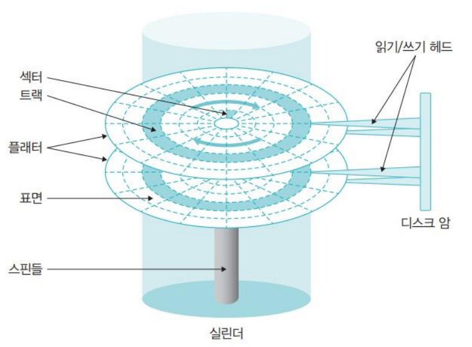
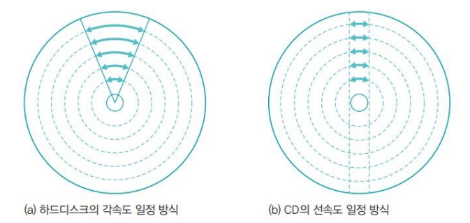

# 디스크 장치

## 디스크 장치의 종류

### 하드디스크

하드디스크는 1956년 처음 개발될 당시 23인치의 크기에 용량은 5MB 정도였다. 당시에는 테이프 드라이브같이 순차적으로 접근하는 저장장치밖에 없었는데, 맨 뒤에 있는 데이터를 읽으려면 테이프를 끝까지 감아야 했다. 하드디스크는 이와 달리 원반을 사용한 저장장치로 맨 앞에 있는 데이터나 맨 뒤에 있는 데이터에 접근하는 속도가 거의 비슷하다.

하드디스크는 메모리를 보조하는 장치라는 의미에서 제2저장장치라고도 불린다. 스핀들이라는 원통 축에 여러 개의 플래터가 달려 있다.

- 플래터 

  플래터는 표면에 자성체가 발려 있어 자기를 이용하여 0과 1의 데이터를 저장할 수 있다. 플래터의 표면이 N극을 띠면 0으로, S극을 띠면 1로 인식한다. 플래터의 수는 하드디스크마다 다르지만 보통 2장 이상으로 구성되며 항상 일정한 속도로 회전한다. 

  한 플래터의 위아래 표면을 다 사용하므로 2개의 표면에 데이터가 저장된다. 하지만 일부 모델에서는 맨 아래 또는 맨 위 디스크의 바깥 면을 사용하지 않는다. 3.5인치 지름의 플래터를 사용하는 하드디스크와 2.5인치 지름의 플래터를 사용하는 하드디스크로 나뉜다.

- 섹터와 블록

  물리적인 개념인 섹터는 하드디스크의 가장 작은 저장 단위이다. 하나의 섹터에는 한 덩어리의 데이터가 저장된다. 블록은 하드디스크와 컴퓨터 사이에 데이터를 전송하는 논리적인 저장 단위 중 가장 작은 단위이다. 블록은 여러 개의 섹터로 구성되며, 윈도우 운영체제에서는 클러스터라고 표현한다. 

  메모리에서는 물리적으로 하나의 바이트마다 주소가 배정된다. 그러나 하드디스크에서는 블록마다 주소가 배정된다.

- 트랙과 실린더

  트랙은 플래터에서 회전축을 중심으로 데이터가 기록되는 동심원, 즉 동일한 동심원 상에 있는 섹터의 집합을 말한다. 헤드는 디스크 암에 고정되어 있기 때문에 모든 헤드가 항상 같이 움직인다. 따라서 헤드는 여러 플래터의 같은 위치에 있는 트랙을 동시에 읽거나 쓸 수 있다. 여러 개의 플래터에 있는 같은 트랙의 집합을 실린더라고 부른다.

- 헤드와 플래터

  하드디스크에서 데이터를 읽거나 쓸 때는 읽기/쓰기 헤드를 사용한다. 헤드의 수는 데이터가 저장되는 플래터의 표면 수와 같다. 플래터가 회전을 시작하면 표면에 약한 바람이 일어나는데, 헤드는 이 바람에 의해 표면에서 약간 떠 있는 형태로 작동한다. 만약 헤드가 플래터에 붙어 플래터에 상처가 생기면 해당 부분은 데이터를 저장할 수 없는 배드 섹터가 된다.

  컴퓨터가 종료될 때 하드디스크는 헤드가 플래터의 표면에 흠집을 내지 않도록 헤드를 데이터가 저장되지 않는 바깥쪽으로 이동하는데 이를 파킹이라고 한다.

 

:pencil2: SSD

SSD는 하드디스크의 느린 속도를 대체하기 위해 사용하는 비휘발성 메모리이다. SSD는 플래시 메모리를 이용하기 때문에 속도가 빠르고 모터를 이용한 구동 부분이 없기 때문에 외부 충격에 강하다. 또한 하드디스크보다 가볍고 전력 소비량도 적다. 하지만 하드디스크에 비해 가격이 비싸다.

 

### CD

하드디스크와 마찬가지로 CD도 트랙과 섹터로 구성되며, 수평으로 움직이는 헤드가 트랙 사이를 움직이면서 데이터를 읽는다. 하지만 하드디스크와는 다르게 CD는 표면에 미세한 홈이 파여 있어 헤드에서 발사된 레이저가 홈에 들어가 반사가 되지 않으면 0, 반사가 되면 1로 인식한다. CD에 데이터를 저장할 때는 레이저를 쏘아 표면을 태워 미세한 홈을 만드는 방식으로 저장한다.

 

### 하드디스크와 CD의 비교

하드디스크와 CD는 둘 다 원반을 사용하지만 구동 방식이 다르다. 하드디스크의 경우 디스크가 작동하는 동안 플래터가 일정한 속도로 돌아가지만, CD의 경우 헤드 위치에 따라 디스크의 회전 속도가 변한다. 

